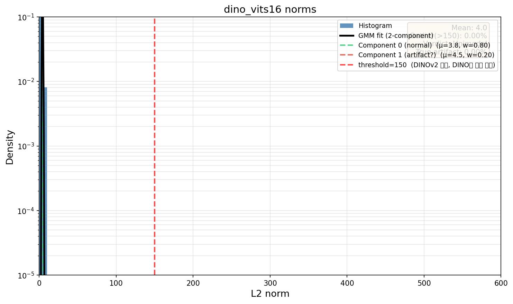
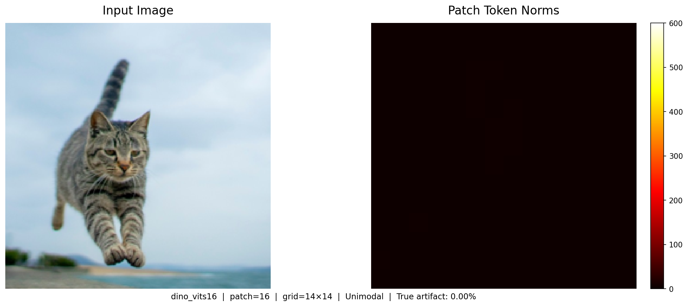
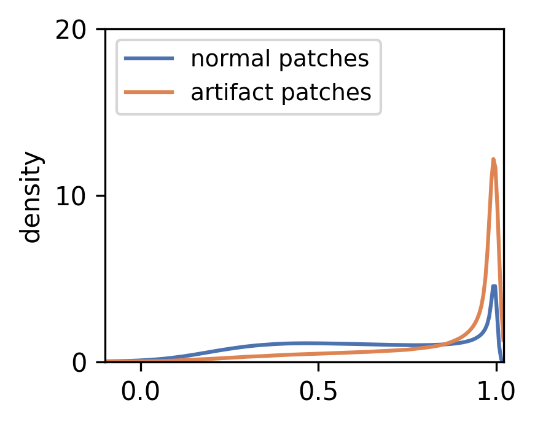
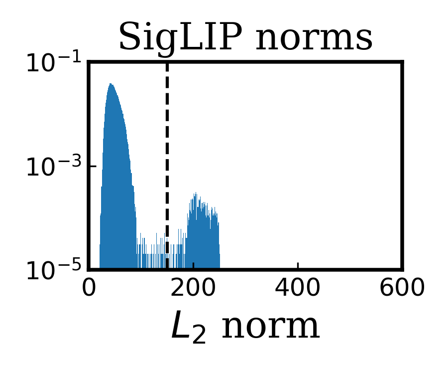
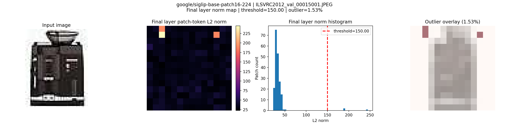
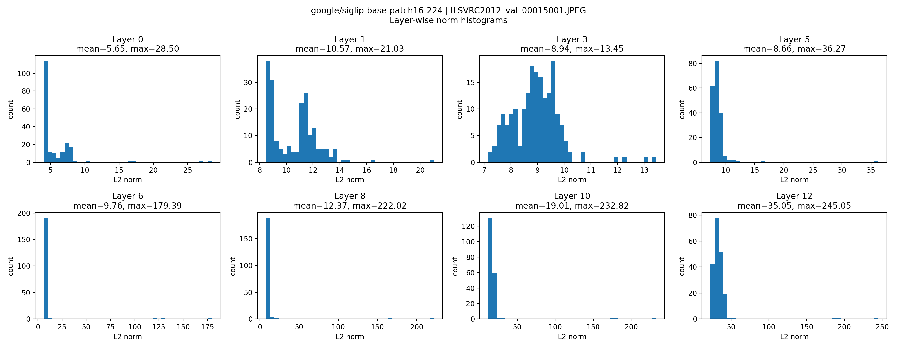

# Vision Transformers Need Registers — Reproduction Study

> Darcet et al., "Vision Transformers Need Registers", ICLR 2024
> ([arXiv:2309.16588](https://arxiv.org/abs/2309.16588))

Term project for DS/DL course: reproducing key experiments from the paper using DINOv2 backbones, with additional analysis on DINO(v1) and SigLIP.

---

## Overview

The paper identifies **artifact tokens** (high-norm outlier patches) in ViT feature maps and proposes appending **register tokens** during training to eliminate them. We reproduce and extend the paper's experiments:

| Experiment | Paper Reference | What we verify |
|---|---|---|
| **Figure 3** | Norm distribution (DINOv2) | Outlier patches show bimodal L2 norm distribution |
| **Figure 3** | Norm distribution (DINO v1) | Original DINO does NOT show bimodal artifacts |
| **Figure 5** | Cosine similarity | Artifact tokens have high similarity with neighbors |
| **Table 1** | Token-level probing | Outlier tokens carry global (class) information |
| **Table 2** | Downstream tasks | Registers improve ImageNet, ADE20k, NYUd |
| **Extension** | SigLIP artifact analysis | Vision-Language ViT also shows high-norm artifacts |

---

## Repository Structure

```
.
├── fig3_norm_visualization.py      # Figure 3: DINOv2 patch norm distribution & norm map
├── fig3_dino_norm_analysis.ipynb   # Figure 3: DINO(v1) norm analysis with GMM bimodality test
├── fig5_cosine_similarity.py       # Figure 5: artifact vs normal patch cosine similarity
├── table1_token_probing.py         # Table 1: CLS / normal / outlier token linear probing
├── table2_imagenet_extract.py      # Table 2: ImageNet feature extraction (multi-GPU)
├── table2_imagenet_linear.py       # Table 2: ImageNet linear classification
├── table2_ade20k_segmentation.py   # Table 2: ADE20k linear segmentation (4-layer BNHead)
├── table2_nyud_depth.py            # Table 2: NYUd monocular depth (Official BNHead)
├── siglip_norm_distribution.py     # Extension: SigLIP dataset-level norm analysis
├── siglip_artifact_visualization.py # Extension: SigLIP per-image artifact visualization
├── results/                        # Experiment results (JSON + images)
└── archive/                        # Previous exploration notebooks & per-member READMEs
```

---

## Experiments & Results

### 1. Figure 3: Patch Token Norm Distribution

#### DINOv2 (bimodal — artifacts present)

Patch token의 L2 norm (LayerNorm 이전, `x_prenorm`)을 시각화하여 outlier의 bimodal distribution을 확인합니다.

```bash
# DINOv2 ViT-L — with vs without registers 비교
python fig3_norm_visualization.py --models dinov2_vitl14 dinov2_vitl14_reg --gpu 0
```

**Observation**: `dinov2_vitl14`에서 norm > 150인 outlier patch가 전체의 약 2-3%를 차지하며, register 모델에서는 이 bimodal peak가 사라짐.

#### DINO v1 (unimodal — no artifacts)

DINO(원본) `ViT-S/16`에서는 DINOv2와 달리 high-norm artifact가 나타나지 않는다는 것을 GMM 기반 bimodality 검출로 확인합니다.

```bash
# Jupyter notebook 실행
jupyter notebook fig3_dino_norm_analysis.ipynb
```

| Model | Distribution | Artifact Ratio | GMM Separation |
|---|---|---:|---|
| DINOv2 ViT-g/14 (paper) | Bimodal | ~3.39% | High |
| DINO ViT-S/16 (ours) | **Unimodal** | **0.00%** | 1.68 (< 3.0 threshold) |
| DINOv2 + reg (paper) | Unimodal | 0% | - |

<p align="center">


</p>

**Key finding**: DINO(v1) ViT-S/16의 patch token norm 분포는 완전히 unimodal (norm range: 3.2~5.5)이며, DINOv2에서 보이는 high-norm artifact가 전혀 존재하지 않음. 이는 논문의 관찰과 정확히 일치.

**Method**: 단순 threshold 대신 2-component GMM을 피팅하여 separation score (`|mu1 - mu2| / ((sigma1 + sigma2) / 2)`)를 계산. Score < 3.0이면 unimodal로 판정하여 false positive를 방지.

---

### 2. Figure 5: Cosine Similarity Analysis

논문 Figure 5(a)에서 artifact token이 주변 patch와 높은 cosine similarity를 갖는다는 관찰을 재현합니다.

```bash
python fig5_cosine_similarity.py \
    --model dinov2_vitg14 \
    --data_dir /path/to/imagenet/val \
    --num_images 50000 \
    --threshold 150 \
    --output_dir ./results
```

| Token Type | Mean Cosine Similarity | Count |
|---|---:|---:|
| Normal patches | 0.6204 | 46,809,338 |
| Artifact patches | **0.8228** | 1,190,662 |

<p align="center">

</p>

**Key finding**: Artifact patch는 주변 4-neighbor와의 cosine similarity가 normal patch보다 **0.20 이상 높음**. Artifact 분포는 similarity ~1.0에 강하게 집중. 이는 high-norm artifact가 균일한 배경 등 patch 정보가 중복되는 영역에서 주로 발생하며, 고유한 시각 정보보다 중복/전역 정보를 저장하는 역할을 함을 시사. Outlier 비율 ~2.48%로 논문(2.37%)과 유사.

**Note**: Cosine similarity는 transformer 최종 출력이 아닌 **patch embedding 직후** feature에서 계산. 최종 출력은 global information이 이미 섞여있어, 원래 이미지에서의 local 중복성을 측정하기 위해 초기 feature를 사용.

---

### 3. Table 1: Token-level Linear Probing

CLS token, normal patch, outlier patch 각각으로 linear probing하여 outlier token이 global information을 carry하는지 확인합니다.

```bash
python table1_token_probing.py \
    --model dinov2_vitg14 \
    --datasets CIFAR10 CIFAR100 Aircraft DTD Flowers102 Food101 Pets Caltech101 CUB200 \
    --auto_threshold \
    --gpu 0
```

**Results (DINOv2 ViT-G14, 224px)**:

| Dataset | CLS | Normal Patch | Outlier Patch | Delta (Outlier - Normal) |
|---|---:|---:|---:|---:|
| CIFAR10 | 99.46 | 97.42 | 99.23 | +1.81 |
| CIFAR100 | 93.95 | 82.16 | 92.70 | +10.54 |
| Food101 | 94.81 | 76.42 | 92.90 | +16.48 |
| CUB200 | 91.28 | 19.58 | 84.62 | +65.04 |
| Aircraft | 87.25 | 18.83 | 74.66 | +55.83 |
| Caltech101 | 93.31 | 74.24 | 96.36 | +22.12 |
| Flowers102 | 99.69 | 61.60 | 99.60 | +38.00 |
| Pets | 96.59 | 50.59 | 93.96 | +43.37 |
| DTD | 81.81 | 58.48 | 83.28 | +24.80 |

**Key finding**: 모든 데이터셋에서 outlier patch의 accuracy가 normal patch보다 크게 높음 (Delta +1.8 ~ +65.0). Outlier token이 class-level global information을 담고 있음을 확인 (논문의 Table 1 trend 재현 성공).

---

### 4. Table 2: Downstream Task Performance

Register token 추가에 따른 downstream task 성능 변화를 재현합니다.

#### (a) ImageNet Linear Classification

DINOv2 best config (4 blocks CLS concat + avgpool → 5120-dim feature)으로 linear probing.

```bash
# Step 1: Feature extraction (multi-GPU)
python table2_imagenet_extract.py --n_gpus 5 --imagenet_root /path/to/imagenet

# Step 2: Linear classifier training
python table2_imagenet_linear.py --gpu 0 --feature_dir ./features_phase1
```

| Model | Top-1 Accuracy (%) | Paper |
|---|---:|---:|
| DINOv2 ViT-L14 | 86.04 | 84.3 |
| DINOv2 ViT-L14 + reg | 86.66 | 84.8 |
| **Delta** | **+0.62** | **+0.5** |

> Our reproduced values are higher than the paper (likely due to different hyperparameters), but the **positive delta (+0.62 vs +0.5)** is consistent.

#### (b) ADE20k Semantic Segmentation

Frozen backbone + 4-layer BNHead (BatchNorm → Conv2d 1x1) linear segmentation.

```bash
python table2_ade20k_segmentation.py \
    --ade20k_root /path/to/ADEChallengeData2016 \
    --models dinov2_vitl14 dinov2_vitl14_reg \
    --image_size 518 --n_iter 20000 --gpu 0
```

| Model | mIoU (%) | Paper |
|---|---:|---:|
| DINOv2 ViT-L14 | 48.96 | 46.6 |
| DINOv2 ViT-L14 + reg | 50.31 | 47.9 |
| **Delta** | **+1.35** | **+1.3** |

> Delta (+1.35 vs +1.3) matches the paper closely.

#### (c) NYUd Monocular Depth Estimation

Official BNHead protocol: 4-layer features with CLS broadcast, UD bins, SigLoss.

```bash
python table2_nyud_depth.py \
    --mat_path /path/to/nyu_depth_v2_labeled.mat \
    --train_split /path/to/train.txt --test_split /path/to/test.txt \
    --models dinov2_vitl14 dinov2_vitl14_reg \
    --n_iter 38400 --gpu 0
```

| Model | RMSE (m) | Paper |
|---|---:|---:|
| DINOv2 ViT-L14 | 0.4957 | 0.378 |
| DINOv2 ViT-L14 + reg | 0.4711 | 0.366 |
| **Delta** | **-0.0246** | **-0.012** |

> Absolute RMSE is higher than paper (training data/augmentation differences), but the **improvement direction with registers is consistent** (lower RMSE with reg).

---

### 5. Extension: SigLIP Artifact Analysis

논문은 DINOv2에서의 artifact를 분석하지만, Vision-Language ViT 계열인 **SigLIP**에서도 유사한 현상이 나타나는지 추가 분석합니다.

#### Dataset-level Norm Distribution

```bash
python siglip_norm_distribution.py \
    --model google/siglip-base-patch16-224 \
    --data_dir /path/to/imagenet/val \
    --num_images 50000 \
    --threshold 150
```

| Metric | Value |
|---|---|
| Total patch tokens | 9,800,000 |
| Mean norm | 46.44 |
| P99 norm | 154.0 |
| Outlier ratio (norm > 150) | **1.01%** |
| Max norm | 255.37 |

<p align="center">

</p>

대부분의 patch token은 norm 25~50 범위에 분포하지만, 일부 token이 190~245 부근의 별도 high-norm 영역을 형성 → SigLIP도 **bimodal-like distribution**을 보임.

#### Per-image Artifact Visualization & Layer-wise Analysis

```bash
python siglip_artifact_visualization.py \
    --image /path/to/image.jpg \
    --model google/siglip-base-patch16-224 \
    --manual_threshold 150
```

<p align="center">


</p>

**Key findings**:
- SigLIP-B/16에서도 high-norm artifact token이 관찰됨 (outlier ratio ~1.01%, DINOv2의 ~2.37%보다 낮음)
- 초기 레이어에서는 artifact가 없으나, **깊은 레이어로 갈수록 high-norm token이 점진적으로 형성**됨
- Artifact는 공간적으로 소수 patch에 국소적으로 집중
- 이는 artifact 형성이 DINOv2 고유 현상이 아닌, ViT 아키텍처의 일반적 특성일 수 있음을 시사

---

## Environment

- **GPU**: NVIDIA A6000 (48GB) x 8
- **Framework**: PyTorch 2.x + torchvision
- **Backbone**: DINOv2 (via `torch.hub`), DINO v1 (via `torch.hub`), SigLIP (via HuggingFace `transformers`)
- **Datasets**: ImageNet-1K, ADE20K, NYU Depth v2, CIFAR-10/100, CUB-200, FGVCAircraft, DTD, Flowers102, Food101, OxfordIIITPet, SUN397, Caltech101

### Requirements

```bash
pip install torch torchvision numpy matplotlib tqdm h5py pillow scikit-learn
pip install transformers  # for SigLIP experiments
```

---

## Team

| Member | Contribution |
|---|---|
| Yeonsu Kim | Table 1 (token probing), Table 2 (ImageNet, ADE20k, NYUd), Figure 3 (DINOv2), experiment pipeline |
| Eunjung | Figure 3 (DINO v1): GMM-based bimodality detection, proving original DINO has no artifacts |
| Hyunbin | Figure 5 (cosine similarity), SigLIP artifact analysis (norm distribution, layer-wise, visualization) |

---

## References

- Darcet, T., Oquab, M., Mairal, J., & Jegou, H. (2024). *Vision Transformers Need Registers*. ICLR 2024.
- Oquab, M., et al. (2023). *DINOv2: Learning Robust Visual Features without Supervision*. arXiv:2304.07193.
- Caron, M., et al. (2021). *Emerging Properties in Self-Supervised Vision Transformers*. ICCV 2021.
- Zhai, X., et al. (2023). *Sigmoid Loss for Language Image Pre-Training*. ICCV 2023.
- Chen, T., et al. (2020). *A Simple Framework for Contrastive Learning of Visual Representations*. ICML 2020.
