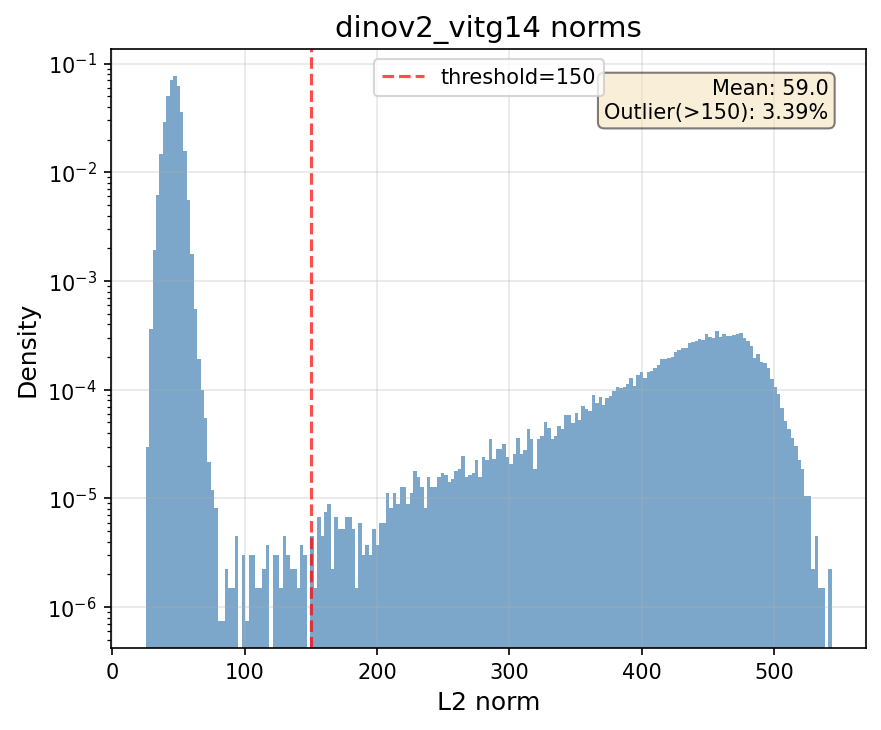
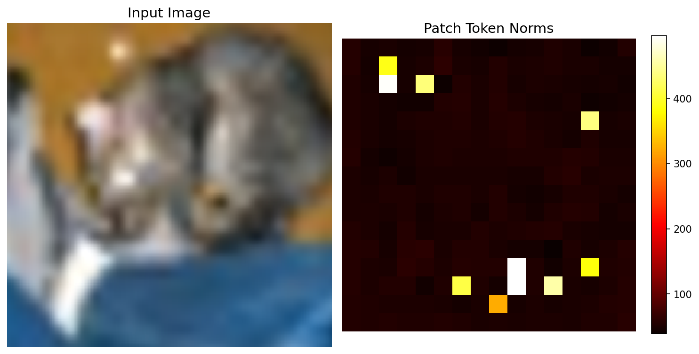
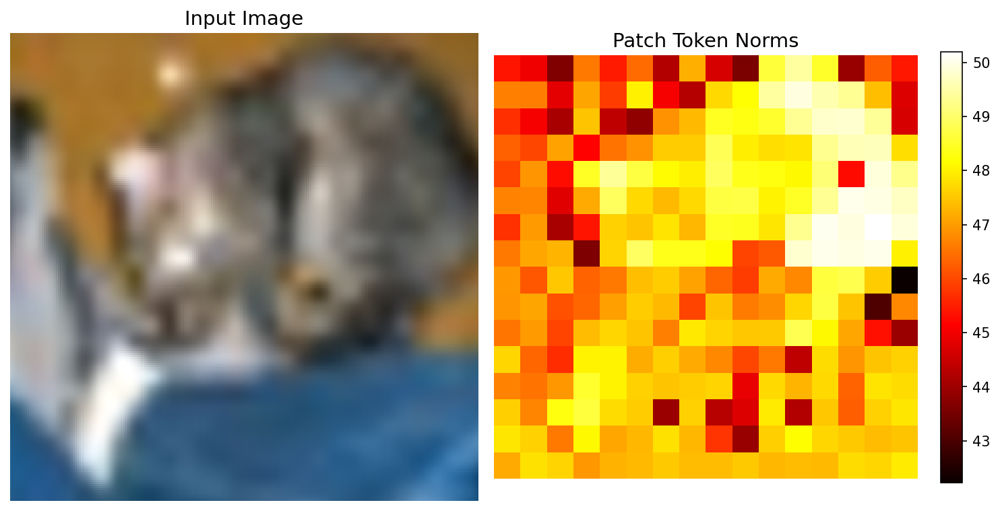
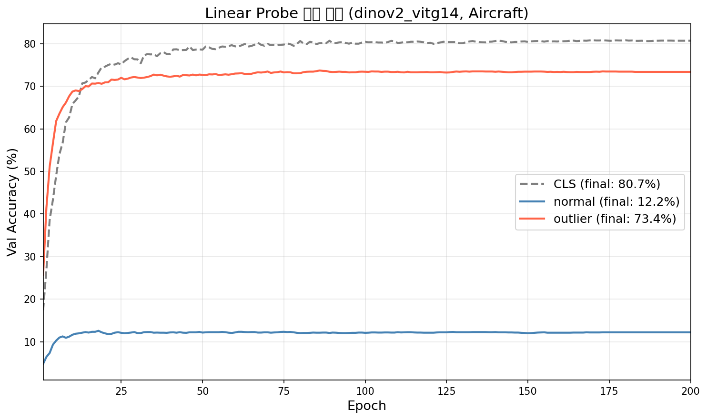

# Yeonsu — DINOv2 Artifact(Outlier Token) 재현 실험

> **논문**: Darcet et al., *Vision Transformers Need Registers*, ICLR 2024
> **담당 파트**: DINOv2 모델에서 나타나는 **high-norm artifact token** 현상을 직접 재현하고,
> 논문의 핵심 주장(*"outlier token은 local 정보를 버리고 global 정보를 담는다"*)을 검증

이 폴더는 사전학습된 **DINOv2 (ViT-L/14, ViT-g/14)** 를 그대로 가져와서, 논문이 제기한
artifact 현상을 세 가지 관점에서 재현한 코드와 결과를 정리한 것입니다.

1. **Norm 분포 / Norm map 시각화** — artifact token이 실제로 존재하는가? (논문 Figure)
2. **Token별 Linear Probing** — CLS / normal patch / outlier patch token으로 image classification 성능 비교 (논문 Table)
3. **Linear Probe 학습 곡선** — 토큰 종류별 수렴 양상 비교

---

## 1. 핵심 아이디어

DINOv2 같은 큰 ViT의 patch token 중 약 2~3%는 **비정상적으로 큰 L2 norm**(outlier/artifact)을 가집니다.
논문은 이 outlier token이 자기 위치의 local 정보를 거의 잃은 대신, 이미지 전체에 대한 **global 정보**를
담고 있다고 주장합니다. 이를 검증하기 위한 대표 실험이 **token별 linear probing** 입니다.

- **CLS token**: 원래 global 정보를 담는 토큰 (기준선)
- **normal patch token** (norm ≤ threshold): local 정보 중심
- **outlier patch token** (norm > threshold): 논문 주장대로라면 global 정보 보유

→ image classification(=global task)에서 **outlier ≫ normal** 이면 논문 주장을 지지하게 됩니다.

prenorm(LayerNorm 이전) 출력 기준으로 norm을 계산해야 outlier가 드러나므로,
모든 스크립트는 `forward_features()`의 `x_prenorm`으로 norm을 측정하고,
linear probing feature는 `x_norm_*`(post-norm)을 사용합니다.

---

## 2. 디렉토리 구조

```
yeonsu/
├── README.md
├── requirements.txt
├── run_token_probing.py        # [실험 2] Table 재현: 소규모 데이터셋 token별 linear probing
├── run_imagenet_probing.py     # [실험 2] ImageNet-1k용 메모리 효율 버전
├── plot_learning_curves.py     # [실험 3] token별 linear probe 학습 곡선
├── visualize_norms.py          # [실험 1] norm 분포 + norm map 시각화
└── results/                    # 실행 결과 (JSON + PNG)
    ├── results_dinov2_vitg14.json          # ViT-g/14 token probing
    ├── results_dinov2_vitl14.json          # ViT-L/14 token probing (Aircraft)
    ├── imagenet_dinov2_vitg14.json         # ImageNet-1k token probing
    ├── learning_curve_dinov2_vitg14_Aircraft.json/.png
    ├── norm_distribution.png               # norm 히스토그램 (bimodal)
    ├── norm_map_dinov2_vitg14.png          # ViT-g/14 patch norm map
    └── norm_map_dinov2_vitl14.png          # ViT-L/14 patch norm map
```

> `data/` (다운로드된 데이터셋, 약 19GB)는 용량 문제로 포함하지 않습니다.
> 아래 데이터셋은 `torchvision`이 `--data_root` 경로에 **자동 다운로드**합니다
> (ImageNet은 직접 준비 필요).

---

## 3. 실행 환경

- Python 3.10+, CUDA GPU 1장 (실험은 RTX 4090 환경 기준)
- DINOv2는 `torch.hub.load('facebookresearch/dinov2', ...)`로 자동 다운로드

```bash
pip install -r requirements.txt
```

| 모델 | 파라미터 | embed dim | 비고 |
|------|----------|-----------|------|
| `dinov2_vits14` | 21M | 384 | outlier 거의 없음 |
| `dinov2_vitl14` | 300M | 1024 | outlier 약하게 존재 |
| `dinov2_vitg14` | 1.1B | 1536 | **artifact 뚜렷 (논문 기준 모델)** |

---

## 4. 실행 방법

### 실험 1) Norm 분포 / Norm map 시각화 (`visualize_norms.py`)

```bash
python visualize_norms.py --models dinov2_vitg14 --gpu 0 --max_images 2000
```
- CIFAR-10 테스트 이미지로 patch token norm을 모아 히스토그램(`norm_distribution.png`)과
  단일 이미지 norm map(`norm_map_*.png`)을 생성합니다.

### 실험 2) Token별 Linear Probing (`run_token_probing.py`)

```bash
# ViT-g/14, threshold 자동(상위 2.37%) 권장
python run_token_probing.py \
    --model dinov2_vitg14 \
    --datasets CIFAR10 CIFAR100 Flowers102 Pets \
    --auto_threshold --num_trials 5 --gpu 0
```
- CLS / normal / outlier 토큰 각각으로 logistic regression linear probing 후 Top-1 정확도 비교.
- 모델마다 norm의 절대 스케일이 달라 `--auto_threshold`(상위 2.37%)가 안전합니다.
- 지원 데이터셋: CIFAR10/100, Aircraft, DTD, Flowers102, Food101, Pets (+ CUB200/ImageNet은 ImageFolder).

ImageNet은 메모리 문제로 전용 스크립트를 사용합니다 (이미지당 토큰 1개만 저장, GPU SGD probe):
```bash
python run_imagenet_probing.py \
    --model dinov2_vitg14 \
    --imagenet_root /path/to/imagenet \
    --train_subset 100000 --num_trials 3 --gpu 0
```

### 실험 3) Linear Probe 학습 곡선 (`plot_learning_curves.py`)

```bash
python plot_learning_curves.py --model dinov2_vitg14 --dataset Aircraft --epochs 200 --gpu 0
```
- epoch마다 val accuracy를 기록해 CLS / normal / outlier의 수렴 곡선을 한 그래프로 그립니다.

---

## 5. 실험 결과

### 5-1. Artifact는 실제로 존재한다 (Norm 분포)



- **DINOv2 ViT-g/14**의 patch norm 분포는 명확한 **bimodal** 형태.
- 대부분 토큰은 norm ≈ 50 부근에 몰려 있고, norm 200~500의 **outlier 봉우리**가 별도로 존재.
- threshold=150 기준 outlier 비율 **3.39%** (논문 보고치 ~2.37%와 같은 수준).

**Norm map** — ViT-g/14는 배경 등 일부 패치에서 norm이 폭발하는 artifact가 또렷하게 보이고(밝은 점),
ViT-L/14는 norm이 43~50의 좁은 범위에 머물러 artifact가 훨씬 약합니다 (모델이 클수록 artifact가 강해진다는 논문 관찰과 일치).

| ViT-g/14 (artifact 뚜렷) | ViT-L/14 (artifact 약함) |
|:---:|:---:|
|  |  |

### 5-2. Outlier token은 global 정보를 담는다 (Token별 Linear Probing)

**DINOv2 ViT-g/14**, threshold=150, 5 trials (Top-1 Acc %):

| Dataset | CLS | normal | outlier |
|---------|----:|-------:|--------:|
| CIFAR10 | 99.5 | 97.3 ±0.1 | **99.3** |
| CIFAR100 | 94.0 | 81.9 ±0.1 | **93.6** |
| Flowers102 | 99.7 | 35.5 ±1.3 | **99.4** |
| Pets | 96.4 | 49.7 ±0.8 | **94.5** |

→ 모든 데이터셋에서 **outlier ≫ normal**, 그리고 outlier는 CLS에 거의 근접.
local 정보 중심인 normal patch는 fine-grained 데이터셋(Flowers102, Pets)에서 특히 크게 뒤처짐.
**논문의 핵심 주장(outlier = global 정보 보유)을 분명하게 재현**.

**DINOv2 ViT-L/14**, auto threshold ≈ 49.6 (Aircraft):

| Dataset | CLS | normal | outlier |
|---------|----:|-------:|--------:|
| Aircraft | 66.4 | 14.4 ±0.5 | 22.3 ±0.8 |

→ ViT-L은 artifact가 약해 outlier-normal 격차가 ViT-g보다 작지만, 여전히 outlier > normal.

**ImageNet-1k**, ViT-g/14 (재현 vs 논문):

| Token | 재현 (Top-1) | 논문 보고치 |
|-------|------:|------:|
| CLS | 82.7 | 86.0 |
| normal | 45.0 | 65.8 |
| outlier | **79.8** | 69.0 |

→ 절대 수치는 probing 설정(subset, GPU SGD probe 등) 차이로 논문과 다르지만,
**outlier ≫ normal** 이라는 정성적 경향은 동일하며 오히려 더 극적으로 나타남.

### 5-3. 학습 곡선 — outlier는 빠르게 수렴, normal은 정체



DINOv2 ViT-g/14, FGVC-Aircraft, 200 epochs:
- **outlier** (최종 73.4%): 초반 몇 epoch 만에 70%대로 급속 수렴 → global 정보를 즉시 활용.
- **CLS** (최종 80.7%): 기준선, 가장 높음.
- **normal** (최종 12.2%): 거의 학습되지 않고 정체 → patch 단위 local feature만으로는 분류 불가.

---

## 6. 결론

| 논문 주장 | 본 재현 결과 |
|-----------|--------------|
| 큰 ViT의 patch norm은 bimodal하고 ~2% outlier 존재 | ✅ ViT-g/14에서 bimodal, outlier 3.39% |
| 모델이 클수록 artifact가 강함 | ✅ ViT-g ≫ ViT-L (norm map 비교) |
| outlier token은 global 정보를 담는다 | ✅ 모든 데이터셋에서 outlier ≫ normal, CLS에 근접 |
| normal patch token은 local 정보 중심 | ✅ image classification에서 현저히 낮은 성능 |

**비판적 코멘트**: ImageNet에서 절대 수치는 논문과 차이가 있는데, 이는 linear probe의 hyperparameter
(C, epoch, train subset)와 norm threshold 설정 차이 때문으로 보입니다. 그러나 *outlier가 global,
normal이 local* 이라는 논문의 핵심 정성적 결론은 모델·데이터셋 전반에서 안정적으로 재현되었습니다.
이는 곧 "register token을 추가해 artifact를 normal token으로 흡수시키면 patch feature 품질이 좋아진다"는
논문 제안의 동기를 실증적으로 뒷받침합니다.

---

## 참고

- Darcet, Oquab, Mairal, Bojanowski. *Vision Transformers Need Registers*. ICLR 2024. [arXiv:2309.16588](https://arxiv.org/abs/2309.16588)
- DINOv2: <https://github.com/facebookresearch/dinov2>
